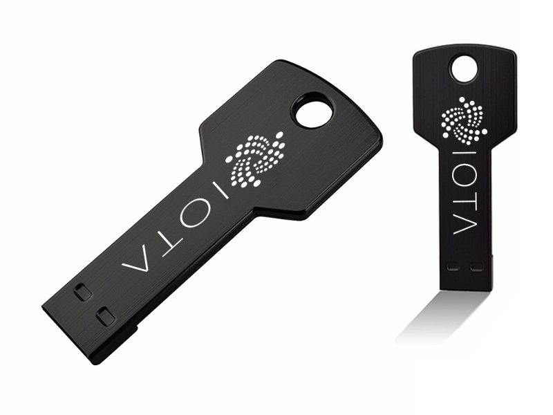
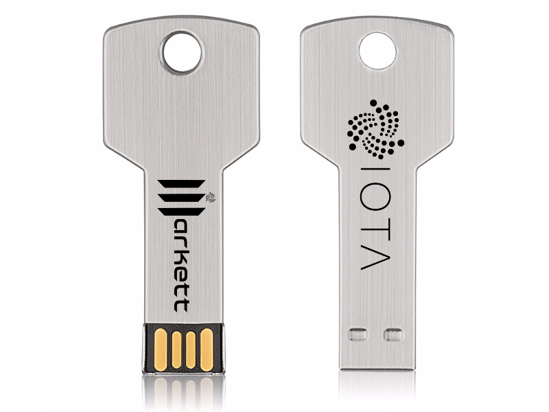

# IOTAusbWallet
This is a program I created for Mac users to be able to generate seeds offline and secure by using the command:

<code>`cat /dev/urandom |LC_ALL=C tr -dc 'A-Z9' | fold -w 81 | head -n 1`</code>

with a bash application created with Platypus.

## Encrypted USB Contents
The product being sold is a MacOS encrypted USB with the following applications on the USB.

1. The Official IOTA Wallet Version 2.5.6
2. The Seed Generator Application (It's contents are shown here in this repository.)
3. Instructions on how to use the Seed Generator and IOTA Wallet.

### Intended Users

The intended users of this product are those that don't understand what a terminal is but still want to own IOTA in a secure manner. This is a plug and play device that allows users with MacOS to use the IOTA Wallet and create seeds with the click of a button. The USBs will be encrypted with a password that the user creates upon purchase of the device.

This is how the USBs will look.

### Product Demo
<iframe width="560" height="315" src="https://www.youtube.com/embed/V9e9iXpKUXk" frameborder="0" allow="autoplay; encrypted-media" allowfullscreen></iframe>